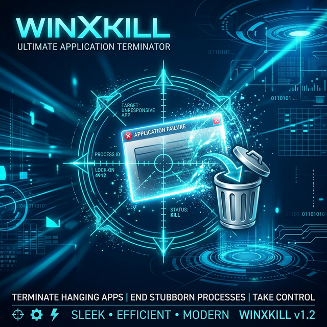
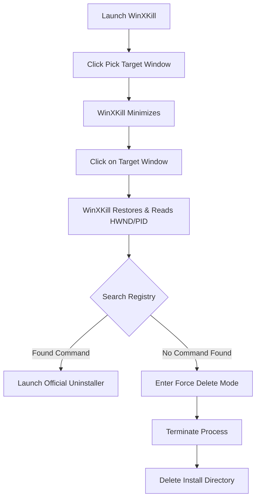

# 🎯 WinXKill (Visual Uninstaller)

<p align="center">
  
</p>

<p align="center">
  
  
  
  <a href="https://xiaozhang2.gumroad.com/l/win-visual-uninstaller"></a>
</p>

<div align="center">
  <h3>🚀 Get the Pro version for just $2.90!</h3>
  <p>Support the development and get the latest pre-compiled, easy-to-use executable.</p>
  <a href="https://xiaozhang2.gumroad.com/l/win-visual-uninstaller" target="_blank">
    
  </a>
</div>

---

**WinXKill** is a visual uninstaller for Windows inspired by Linux's `xkill`. Don't like a window? Just "point and click." The tool automatically identifies the program information and launches the official uninstaller or performs a "force delete" for stubborn software.

## 🛠️ Workflow



## ✨ Key Features

- **🎯 Crosshair Interaction**: Click the "Pick" button and whatever you click is your target.
- **🔍 Smart Recognition**: Automatically finds the installation path and registry uninstall commands using the Process ID.
- **🛡️ Security Guard**: Built-in protection for critical system processes (e.g., `explorer.exe`) to prevent accidental damage.
- **⚡ Dual Modes**:
  - **Graceful Mode**: Prioritizes the software's official uninstaller if available.
  - **Force Mode**: For bloatware or leftover files, it terminates the process and physically deletes the directory.

## 📺 Demo

> Here is a demonstration of how to quickly enter the uninstallation process by clicking on a window.

<p align="center">
  <video src="video/ev_20260315_142310.mp4" width="800" controls>
    Your browser does not support the video tag. Please view the video in the video folder.
  </video>
</p>

*(Note: If GitHub does not play the video directly, click [here](./video/ev_20260315_142310.mp4) to view the source file.)*

## 🚀 Quick Start

### Prerequisites
This tool requires Python and the following libraries:
- `tk` (usually included with Python)
- `pywin32`
- `psutil`

### Installation
```bash
# Clone the repository
git clone https://github.com/your-username/rubbishbin.git
cd rubbishbin

# Install dependencies
pip install pywin32 psutil
```

### Usage
Make sure to run the script as an **Administrator**, otherwise, it won't be able to read registry info or terminate other processes:
```bash
python main.py
```

### 📦 Packaging as EXE
If you want to distribute a standalone executable, you can use `PyInstaller`:

1. **Add packaging dependency**:
   ```bash
   uv add pyinstaller
   ```

2. **Run build command**:
   ```bash
   uv run pyinstaller --onefile --noconsole --uac-admin --name WinXKill main.py
   ```
   - `--onefile`: Generates a single standalone EXE file.
   - `--noconsole`: Hides the command console when running.
   - `--uac-admin`: Automatically requests Admin privileges (adds a shield icon).

The generated `WinXKill.exe` will be located in the `dist/` folder.

## 🛠️ Tech Stack
- **GUI**: Tkinter
- **OS Interaction**: Windows API (win32gui, win32process, win32api)
- **Registry**: Software info extraction via `winreg`
- **Process Mgmt**: `psutil`

## 💰 Support & License
WinXKill is a paid product. You can purchase the officially supported and pre-compiled version on [Gumroad](https://xiaozhang2.gumroad.com/l/win-visual-uninstaller) for **$2.90**.

- Your support helps keep this project updated!
- For full license details, please see the [LICENSE](./LICENSE) file.

## ⚠️ Disclaimer
This tool includes a "Force Delete" feature. Use it with caution and ensure your target is correct. The author is not responsible for any data loss caused by misuse.

---
<p align="center">Made with ❤️ for a cleaner Windows.</p>