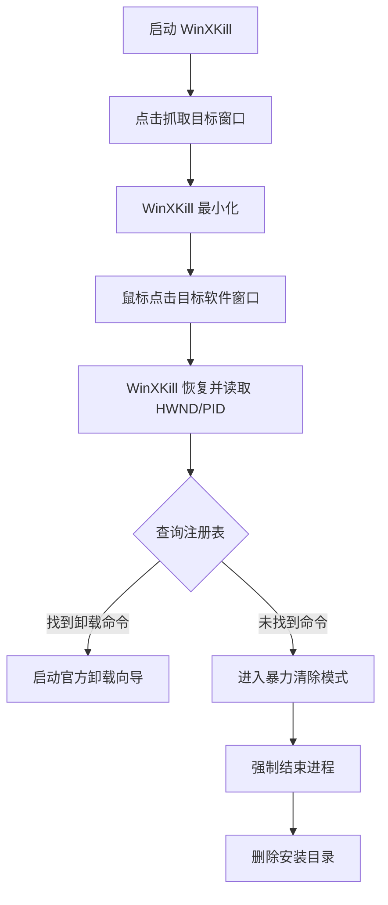

# 🎯 WinXKill (Visual Uninstaller)

<p align="center">
  
</p>

<p align="center">
  
  
  
</p>

---

**WinXKill** 是一款受 Linux `xkill` 启发的 Windows 可视化卸载工具。看不惯哪个窗口？只需“点它”，本工具就能自动识别程序信息，并启动官方卸载程序或进行“暴力”强力清除。

## 🛠️ 工作流程



## ✨ 核心特性

- **🎯 准星级交互**：点击“抓取”按钮，鼠标所指即是目标。
- **🔍 智能识别**：自动通过进程 ID 反查安装目录及注册表卸载命令。
- **🛡️ 安全防护**：内置系统关键进程（如 `explorer.exe`）保护机制，防止误操作。
- **⚡ 两种模式**：
  - **优雅模式**：优先调用软件自带的官方卸载流程。
  - **暴力模式**：针对流氓软件或残留文件，强制结束进程并物理删除目录。

## 📺 使用演示

> 如下为实机操作演示，展示了如何通过点击窗口快速进入卸载流程。

<p align="center">
  <video src="video/ev_20260315_142310.mp4" width="800" controls>
    您的浏览器不支持视频展示，请直接查看 video 文件夹下的视频文件。
  </video>
</p>

*（注：如果 GitHub 无法直接播放视频，请点击 [此处](./video/ev_20260315_142310.mp4) 查看源码）*

## 🚀 快速开始

### 环境依赖
本工具需要 Python 环境及以下库：
- `tk` (通常 Python 自带)
- `pywin32`
- `psutil`

### 安装
```bash
# 克隆仓库
git clone https://github.com/your-username/rubbishbin.git
cd rubbishbin

# 安装依赖
pip install pywin32 psutil
```

### 运行
请务必以 **管理员身份** 运行，否则将无法读取其它程序的安装信息或结束进程：
```bash
python main.py
```

## 🛠️ 技术栈
- **GUI**: Tkinter
- **OS Interaction**: Windows API (win32gui, win32process, win32api)
- **Registry**: Software info extraction via `winreg`
- **Process Mgmt**: `psutil`

## ⚠️ 免责声明
本工具包含“强力删除”功能，使用前请务必确认目标正确。对于因误操作导致的数据丢失，作者概不负责。建议在执行“暴力模式”前仔细阅读弹出的确认对话框。

---
<p align="center">Made with ❤️ for a cleaner Windows.</p>